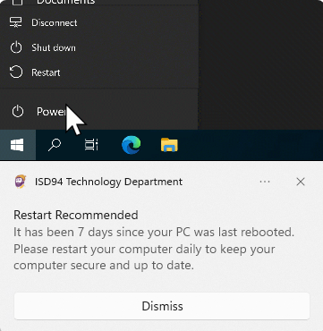
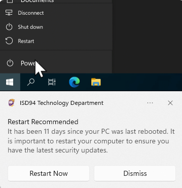
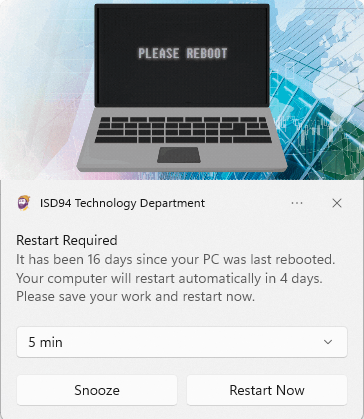
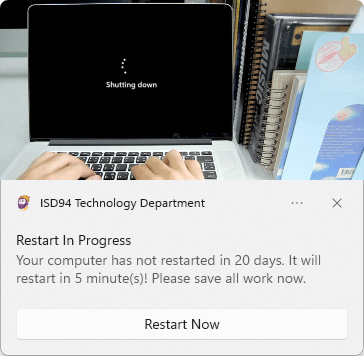

# Restart-Reminder-Toast-Notifications
This PowerShell project sends Windows toast notifications to remind users to restart their computers based on system uptime. It uses engaging visuals (GIFs and icons) and provides interactive options such as restarting immediately, snoozing the reminder, or dismissing it. The notifications escalate in urgency as uptime increases, culminating in a forced restart after 20 days. The solution is designed for IT administrators and can be deployed via Microsoft Intune as a proactive remediation script or as a scheduled task using Group Policy.

## Features
- **Dynamic Notifications**: Displays toast notifications with messages tailored to system uptime (6, 11, 16, or 20+ days).
- **Interactive Options**:
  - Restart immediately via a custom protocol.
  - Snooze reminders (5 min, 10 min, 1 hr, 4 hrs, or 1 day) for 16+ day notifications.
  - Dismiss notifications for less urgent reminders.
- **Visuals**: Uses GIFs and a custom icon for a polished user experience.
- **Uptime Detection**: Accurately calculates uptime, accounting for FastBoot scenarios.
- **Deployment Options**:
  - Microsoft Intune proactive remediation for modern management.
  - Scheduled task via Group Policy for traditional environments.
- **Exemption Support**: Allows specific devices to opt out via a `DisableNag.txt` file.

## Screenshots
Below are examples of the toast notifications displayed at different uptime thresholds:
<figure>
  <figcaption><b>Gentle reminder to restart after 6 days.</b></figcaption>
  
</figure>

<figure>
  <figcaption><b>Recommendation to restart for security updates.</b></figcaption>
  
</figure>

<figure>
  <figcaption><b>Urgent reminder with snooze and restart options.</b></figcaption>
  
</figure>

<figure>
  <figcaption><b>Forced restart countdown with immediate restart option.</b></figcaption>
  
</figure>

## Prerequisites
- Windows 10 or 11.
- PowerShell 5.1 or later.
- Administrative privileges for deployment.
- Internet access for downloading image assets (if not pre-deployed).
- For Intune: Access to the Microsoft Endpoint Manager admin center.
- For GPO: Permissions to create scheduled tasks in Active Directory.

## Repository Structure
- `RestartReminderToast.ps1`: Main script for displaying toast notifications.
- `Detect-Reboot.ps1`: Intune detection script to check if a restart is needed.
- `Detect-Images.ps1`: Intune detection script to verify image assets.
- `Remediate-Images.ps1`: Intune remediation script to download missing images.
- `images/`: Placeholder folder for image assets (populate with your own or use provided URLs).
- `DisableNag.txt`: Optional file to disable reminders on specific devices.

## Image Assets
The toast notifications use the following assets, which must be available at `C:\Program Files\RestartReminder\`:
- `notification_icon.ico`: Notification icon.
- `startrestart.gif`: Hero image for 6- and 11-day notifications.
- `pleasereboot.gif`: Hero image for 16-day notifications.
- `shuttingdown.gif`: Hero image for 20-day forced restart notifications.

You can host these assets at a public URL (e.g., a CDN or web server) or pre-deploy them to the target directory. The `Detect-Images.ps1` and `Remediate-Images.ps1` scripts automate downloading if assets are missing.

## Deployment Instructions

### Option 1: Microsoft Intune Proactive Remediation
This method uses Intune to detect devices that haven't restarted in over 5 days and trigger the toast notification script. It also ensures image assets are present.

1. **Prepare Image Assets**:
   - Host the required images (`notification_icon.ico`, `startrestart.gif`, `pleasereboot.gif`, `shuttingdown.gif`) at a publicly accessible URL.
   - Update the URLs in `Remediate-Images.ps1` to point to your hosted images.

2. **Create Proactive Remediation for Images**:
   - In the Microsoft Endpoint Manager admin center, navigate to **Devices > Scripts & Remediations**.
   - Click **Create** and name it (e.g., "Ensure Restart Toast Images").
   - Upload `Detect-Images.ps1` as the detection script.
   - Upload `Remediate-Images.ps1` as the remediation script.
   - Set to run as **System** context.
   - Assign to a device group and schedule (e.g., once).

3. **Create Proactive Remediation for Reboot Reminders**:
   - Create another proactive remediation named (e.g., "Restart Reminder Toast").
   - Upload `Detect-Reboot.ps1` as the detection script.
   - Upload `RestartReminderToast.ps1` as the remediation script.
   - Set to run as **User** context to ensure the toast notification appears for the logged-in user.
   - Assign to a device group and schedule (e.g., daily at 7am).

4. **Optional: Disable Reminders on Specific Devices**:
   - Place a `DisableNag.txt` file at `C:\Program Files\RestartReminder\` on devices that should not receive reminders.

5. **Monitor**:
   - Check the **Proactive remediations** report in Intune to verify detection and remediation status.

### Option 2: Scheduled Task via Group Policy
This method deploys the script as a scheduled task for environments using Active Directory, running as the logged-in user.

1. **Prepare Image Assets**:
   - Pre-deploy the images to `C:\Program Files\RestartReminder\` on target devices using a GPO or script, or update `RestartReminderToast.ps1` to download them from your hosted URLs.

2. **Create a GPO**:
   - Open the Group Policy Management Console.
   - Create a new GPO (e.g., "Restart Reminder Task") and link it to the appropriate OU.
   - Navigate to **User Configuration > Preferences > Control Panel Settings > Scheduled Tasks**.
   - Create a new **Scheduled Task (At least Windows 7)**:
     - **Name**: RestartReminderToast
     - **Action**: Update
     - **Run as**: `%LogonUser%` (to run as the current logged-in user).
     - **Trigger**: Daily, set a time (e.g., 8:00 AM).
     - **Action**: Start a program
       - **Program**: `powershell.exe`
       - **Arguments**: `-ExecutionPolicy Bypass -File "C:\Program Files\RestartReminder\RestartReminderToast.ps1"`
     - **Conditions**: Optional, e.g., Run immediately if schedule missed
     - **Settings**: Enable "Allow task to be run on demand" and "Restart if the task fails".

3. **Deploy the Script**:
   - Use a GPO to copy `RestartReminderToast.ps1` to `C:\Program Files\RestartReminder\` on target devices:
     - Go to **Computer Configuration > Preferences > Windows Settings > Files**.
     - Add a new file action to copy the script from a network share to the destination path.

4. **Optional: Disable Reminders**:
   - Deploy `DisableNag.txt` to `C:\Program Files\RestartReminder\` on exempt devices using a similar GPO file preference.

5. **Apply the GPO**:
   - Assign the GPO to the desired OU and run `gpupdate /force` on test devices to verify.

## Usage Notes
- **Notification Behavior**:
  - **6 days**: Gentle reminder to restart daily, dismissible.
  - **11 days**: Recommends restart for security updates, with restart or dismiss options.
  - **16 days**: Warns of an impending automatic restart, with snooze or restart options.
  - **20+ days**: Forces a restart in 5 minutes with a countdown, allowing immediate restart.
- **Snooze Options**: Available at 16 days, allowing users to delay the reminder temporarily.
- **Forced Restart**: After 20 days, the script schedules a restart in 5 minutes, updating the notification every minute.
- **FastBoot Handling**: The script accounts for Windows FastBoot to ensure accurate uptime calculation.

## Customization
- **Messages**: Modify the `$Title` and `$Message` variables in `RestartReminderToast.ps1` to change notification text.
- **Timing**: Adjust the `$Days` thresholds in the `switch` statement to change when notifications appear.
- **Images**: Replace the GIFs and icon with your own, updating paths in `RestartReminderToast.ps1`.
- **Audio**: Change the `ms-winsoundevent` sounds in the `$Audio` variable for different notification tones.
- **Exemption**: Use `DisableNag.txt` for devices that should not receive reminders (e.g., servers).

## Troubleshooting
- **No Notifications**: Verify the script is running as the logged-in user and the image files exist at the specified path.
- **Incorrect Uptime**: Ensure event logs are accessible and FastBoot detection is working.
- **Intune Failures**: Check the Intune logs under `C:\ProgramData\Microsoft\IntuneManagementExtension\Logs`.
- **GPO Issues**: Confirm the scheduled task is created and running as the logged-in user in Task Scheduler.

## License
This project is licensed under the MIT License. See the [LICENSE](LICENSE) file for details.

## Contributing
Contributions are welcome! Please submit a pull request or open an issue to discuss improvements.

## Acknowledgments
- This project was inspired by:
  - [Syst & Deploy: A toast notification to display warning messages](https://www.systanddeploy.com/2022/02/a-toast-notification-to-display-warning.html) for its approach to crafting interactive Windows toast notifications.
  - [MSEndpointMgr: Endpoint Analytics Proactive Remediations](https://msendpointmgr.com/2020/06/25/endpoint-analytics-proactive-remediations/) for guidance on deploying proactive remediation scripts in Intune.
- Built to promote regular system restarts in managed IT environments.
